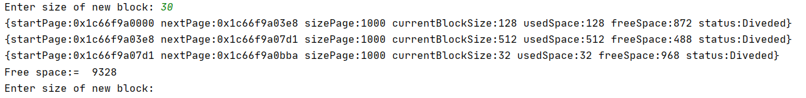

# Лабораторная работа №2: Аллокатор с страницами

##### Что такое аллокатор и зачем он нужен?
Основная задача аллокатора выделять и освобождать память в требуемых количествах определённым образом. **std::allocator** -- пример реализации аллокатора из стандартной библиотеки, просто использует new и delete, которые обычно обращаются к системным вызовам **malloc** и **free**.
##### Задачи лабораторной роботы :
1. Сделать системный вызов для выделения памяти. Вернуть указатель на данный участок памяти и её размер в байтах. 
2. Выделить память с определенным размером в байтах. Если блок памяти был выделен успешно, то вернуть адрес начала этого блока, в противном случае вернуть NULL.
3. Сделать функцию для освободждения блока памяти. 

##### Алгоритм работы аллокатора: 
1. Изначальное состояние: **был сделан системный вызов для выделение определенного участка в памяти** => **данный учаток памяти был разбит на страницы (все страницы одного размера)**. Так же следует отметить, что изначально страницы не разбиты на блоки.
2. Был запрос на выделение определеного учатка памяти в системе. Например если запрос был сделан на выделение **100 мб** памяти алгоритм работы следующий : **найти размер текущего блока, который является ближайшим степенем двойки** => **просмотреть все страницы и найти странницу, которая уже разбита на блоки определенного размера**. 
3. Если страница с нужным размером блока была найдена => **проверить если ли там нужное колличество места** => **если есть то, выделить память на данной страницу. Обновить её описание, а именно сколько сейчас блоков памяти занято и сколько еще свободного места она в себе содержит**.
4. Если страница с нужным размером блока не была найдена => **следует взять новую страницу** => 
**обновить состояние страницы** 
4.1 Внести информацию о размере текущего блока в странице
4.2 Внести информацию сколько места было занято и сколько свободно на данной странице.
4.3 Обновить статус страницы на **заполненный**.

5. Если был запрос на выделение блока, размер которого больше чем страница. 
5.1 Проверить является ли размер блока больше чем размер страницы.
5.2 Найти колличество нужных страниц.
5.3 Внести информацию о размере блока, что был запрошен.
5.4 Внести информацию сколько места было занято.
5.5 Обновить статус страницы на **мультистраничный блок**.

##Примеры работы:

Пример деления страниц на блоки и обновление их состояния.

Пример создания мультистраничного блока.
